# DroneAR — Magic Leap 2용 YOLO26 드론 탐지

> 🌐 English version: [README_English.md](README_English.md)

**DUT-Anti-UAV**(+ **Maciullo DroneDetectionDataset** 병합, 학습 데이터 10×)로 **YOLO26** 드론(UAV)
탐지 모델 학습 → **Magic Leap 2(ML2)** 배포용 export. 재현 가능한 end-to-end 파이프라인이다.

- **학습 환경:** RTX 4090 24GB / Linux / CUDA (학습 전용)
- **추론 타깃:** ML2 — AMD "Mero" SoC (Zen2 쿼드코어 x86-64 CPU + RDNA2 iGPU), 16GB,
  AOSP Android 10 (API 29). **NVIDIA 아님** → 디바이스 TensorRT/CUDA 불가.
  검증 경로: **ONNX → ONNX Runtime(+MLSDK C API), CPU 백엔드 XNNPACK.**
- **모델 결정:** `yolo26n`(nano) 우선, **NMS-free one-to-one head 유지**, `imgsz=640`,
  INT8/FP16 export.

> 상태: 기본 파이프라인 완료 (데이터 → 학습 → 평가 → ML2 export → 벤치 → Docker 검증).
> 확장: 데이터 병합(10×) · 960+P2 · 추론 1280 — [Ablation](#ablation) 참조.

> GPU 경로 탐색: RDNA2 iGPU 추론용 **ncnn-Vulkan** 경로 검증은
> [README_ML2_Vulkan.md](README_ML2_Vulkan.md) 참조 (호스트 4090 Vulkan 검증, ML2 on-device 미검증).

---

## 성능 지표 (모델 선택 기준)

### 정확도 (150 epochs) — `weights/metrics.json` (test 기준; val 지표는 json 참조)

| 모델 | imgsz | mAP50 | mAP50-95 | Precision | Recall | Params(M) | FLOPs(G) | best.pt |
|------|------:|------:|---------:|----------:|-------:|---------:|--------:|--------:|
| yolo26n | 640 | 0.951 | 0.648 | 0.963 | 0.922 | 2.4 | 5.2 | 5.4 MB |
| **yolo26n** | **960** | **0.968** | **0.699** | 0.976 | 0.936 | 2.4 | 11.7 | 5.5 MB |
| yolo26s | 640 | 0.958 | 0.681 | 0.968 | 0.945 | 9.5 | 20.5 | 20.3 MB |
| **yolo26s** | **960** | **0.970** | **0.723** | 0.981 | 0.956 | 9.5 | 46.2 | 20.4 MB |

> Params·FLOPs는 하드웨어 독립 복잡도다. **FLOPs(G)**: 각 행 imgsz 기준, ultralytics fused,
> **2×MAC 관례**(곱·합 각 1회 = MACs×2), 정밀도 무관. FLOPs ∝ 입력 픽셀 → 960은 640의 약 2.25배.

- imgsz **960이 640 대비 test mAP50-95 +4~5%p** (소형 객체 ~77% → 해상도 효과 큼). 단 추론 비용 ↑(입력 2.25배).
- 병합(merged) 모델 성적·구성별 기여: [Ablation](#ablation). 추론 예시: [Demo](#demo-추론-예시).

### 추론 속도 — GPU (RTX 4090)

config: imgsz=640, batch=1(single-stream), warmup=30, iters=200, **순수 forward(전·후처리·NMS 제외)**,
torch CUDA(`cuda.Event` 계측), FPS = 1000/mean. 측정 하드웨어 **NVIDIA RTX 4090**. 원본 로그: `weights/latency_gpu.md`.

| 모델 | 정밀도 | latency mean±std (ms) | FPS |
|------|--------|---------------------:|----:|
| yolo26n | FP32 | 2.40 ± 0.10 | 417 |
| yolo26n | FP16 | 2.48 ± 0.10 | 403 |
| yolo26s | FP32 | 2.44 ± 0.14 | 410 |
| yolo26s | FP16 | 2.57 ± 0.08 | 389 |

- batch=1·작은 모델은 RTX 4090을 포화시키지 못해 커널 실행·메모리 대역폭에 묶임(GPU 미포화) → 모델·정밀도 간 차이가 작다.

**정밀도별 GPU 적합성** (산출물은 모두 ONNX):

| 정밀도 | 성격 | GPU |
|--------|------|-----|
| FP32 | 중립(기준) | 표준 동작 |
| FP16 | GPU/NPU 친화(반정밀) | 이득 ↑ (CPU는 native 커널 없어 이득 X) |
| INT8 | CPU/XNNPACK 지향(QDQ Conv-only) | INT8 가속 못 받음 ⚠️: 그러나 ML2 환경에서는 가장 적합할 것으로 예상. |

INT8 GPU 가속은 TensorRT 엔진 별도 빌드 필요(현재 미측정). 정확도는 디바이스 불변 — 차이는 속도뿐.

### 추론 속도 — CPU (i9-13900K, ONNX Runtime)

config: ORT **CPUExecutionProvider**, imgsz=640, batch=1, warmup=30, iters=200,
`intra_op_num_threads`=1·4 (inter_op=1, sequential), FPS = 1000/mean. 측정 하드웨어
**Intel i9-13900K**. 원본 로그: `weights/latency_report.md`.

| 모델 | 정밀도 | 크기(MB) | threads=1 (ms) | threads=4 (ms) | threads=1 (FPS) | threads=4 (FPS) |
|------|--------|--------:|------------:|------------:|-------------:|-------------:|
| yolo26n | FP32 | 9.80 | 44.0 ± 0.5 | 13.2 ± 0.2 | 23 | 76 |
| yolo26n | FP16 | 4.97 | 45.5 ± 0.8 | 13.9 ± 0.2 | 22 | 72 |
| yolo26n | INT8 | 3.01 | **33.7 ± 0.9** | 15.1 ± 0.4 | **30** | 66 |
| yolo26s | FP32 | 38.17 | 149.6 ± 1.4 | 41.3 ± 0.9 | 7 | 24 |
| yolo26s | FP16 | 19.15 | 151.7 ± 1.5 | 42.4 ± 0.6 | 7 | 24 |
| yolo26s | INT8 | 10.24 | **86.6 ± 2.0** | 34.6 ± 0.7 | **12** | 29 |

- **FP16**: ORT CPU에 native fp16 커널 없음 → 속도 이득 없음(크기/이식성 옵션).
- **INT8**: 단일 스레드에서 가장 빠름. Conv-only QDQ라 4스레드에선 dequant 오버헤드로 이점 축소.
- 속도는 imgsz 640 기준. 960은 미측정(입력 2.25배).
- **ML2 온디바이스 실측(2026-07)**: yolo26n 640 CPU **~15 FPS** — i9-13900K 대비 ~1/5 (Zen2). GPU(ncnn-Vulkan)는 미측정.

### Export 산출물 (정밀도·크기) — NMS-free head, 출력 `[1,300,6]`

| 정밀도 | 파일 | 크기 | 비고 |
|--------|------|-----:|------|
| FP32 | `weights/yolo26n_drone_640_fp32.onnx` | 9.80 MB | 기준; opset17, static, simplified |
| FP16 | `weights/yolo26n_drone_640_fp16.onnx` | 4.97 MB | native `half=True`; float16 I/O |
| INT8 | `weights/yolo26n_drone_640_int8.onnx` | **3.01 MB** | static PTQ(QDQ), Conv-only, 200장 캘리브 |

**INT8 vs FP32** (동일 val 20장, conf 0.25): yolo26n 탐지 27→27(평균 IoU 0.961, |Δscore| 0.075),
yolo26s 27→26(평균 IoU 0.966, |Δscore| 0.103) → 저하 미미.

비교군/해상도 산출물: yolo26s_640 FP32 38.2 / FP16 19.2 / INT8 10.2 MB ·
imgsz 960(입력 `[1,3,960,960]`) yolo26n_960 10.0/5.1/**3.2** MB · yolo26s_960 38.4/19.3/10.5 MB
(`weights/yolo26{n,s}_drone_960_{fp32,fp16,int8}.onnx`).

---

## Ablation

구성별 기여 분해 — yolo26n(A–F) · **yolo26l(H·I)**, seed 0, 파이프라인 동일. far = far-recall(<16px@640). 미측정 = "—".

| # | merged | 960학습 | P2 | 1280추론 | ep | DUT AP50 | DUT AP50-95 | DUT far | Maci AP50 | Maci AP50-95 | Maci far |
|---|:---:|:---:|:---:|:---:|---:|---:|---:|---:|---:|---:|---:|
| A (old) | | | | | 150 | 0.951 | 0.648 | 0.925 | 0.601 | 0.216 | 0.359 |
| B | | ✓ | | | 150 | 0.968 | 0.699 | 0.960 | 0.591 | 0.199 | 0.354 |
| C | ✓ | | | | 100 | 0.927 | 0.619 | 0.820 | **0.891** | 0.445 | 0.783 |
| D | ✓ | | | | 300 | 0.950 | 0.650 | 0.876 | 0.858 | 0.415 | 0.748 |
| E | ✓ | ✓ | ✓ | | 100 | 0.966 | 0.690 | 0.933 | 0.888 | 0.447 | 0.793 |
| F (=E, 추론만 1280) | ✓ | ✓ | ✓ | ✓ | 100 | 0.967 | 0.694 | 0.943 | 0.885 | 0.437 | **0.803** |
| **H (l-P2)** | ✓ | ✓ | ✓ | | 100 | **0.982** | **0.769** | 0.960 | 0.888 | **0.450** | 0.783 |
| I (=H, 추론만 1280) | ✓ | ✓ | ✓ | ✓ | 100 | 0.982 | 0.766 | **0.968** | 0.888 | 0.441 | 0.793 |

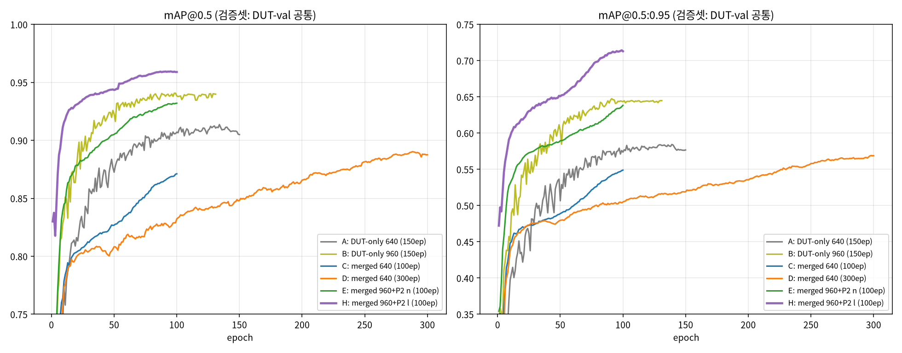

- 곡선(검증셋 DUT-val 공통): **해상도(960) = 최대 레버**, 640은 300ep로도 960 미달. merged의 Maciullo 도메인 이득은 이 곡선에 미반영.
- 병합(A→C): Maciullo +29pt·DUT far −10.5pt → epochs(C→D)·960+P2(C→E)로 회복. B(DUT-only 960)는 Maciullo 붕괴(0.591) — 해상도 단독으론 도메인 이전 없음.
- 모델 스케일(E→H, n→l): DUT AP50-95 **+7.9pt**·far +2.7pt, Maci <8px 0.636→0.727. 추론 1280(E→F, H→I)은 AP 중립·far 무비용 이득.
- **P2 단독 기여는 미분리**(merged+960+P2無 미학습) — E의 이득은 960+P2 **결합**으로만 주장. 상세: [reports/ablation_matrix.md](reports/ablation_matrix.md).

**배포 권장** (근거는 위 표):

| 경로 | 모델 | 이유 |
|---|---|---|
| 클라우드(4090) | **H: merged-l-P2-960** + 추론 1280 (=I) | 전 도메인 최고/동급, DUT far 0.968, 4090 FP16 103FPS |
| 클라우드 경량 대안 | E: merged-P2-960 + 추론 1280 (=F) | H 대비 −7pt(AP50-95), 4.2ms(236FPS) |
| 온디바이스(ML2, ncnn-Vulkan) | **D: merged-300ep** (640) | 무회귀·FP/img 최저 |
| Maciullo 도메인 특화 | C: merged-100ep (640) | 해당 도메인 AP50 최고 |

### Maciullo 라벨 감사 — AP50 0.89 천장 원인

전 구성(A~I)에서 Maciullo AP50이 0.86~0.89에 수렴 → l-P2 오답 전수 시각화(FN 406·FP 146) 후
육안 판정(2026-07-08). **FP의 68%가 conf≥0.5** — 상위 케이스 다수는 **GT 박스 품질 문제**로,
모델이 맞게 탐지해도 IoU<0.5가 되어 FP+FN 이중 감점 → AP 천장 형성. 색: 초록=GT, 빨강=FP 예측.

**FP 상위 — GT 크기 부정확:**

| fp_000318 · GT 과대 | fp_000126 · GT 과대 | fp_002025 · GT 과소 |
|:---:|:---:|:---:|
| 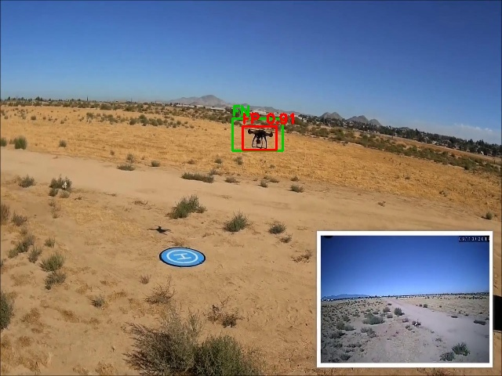 | 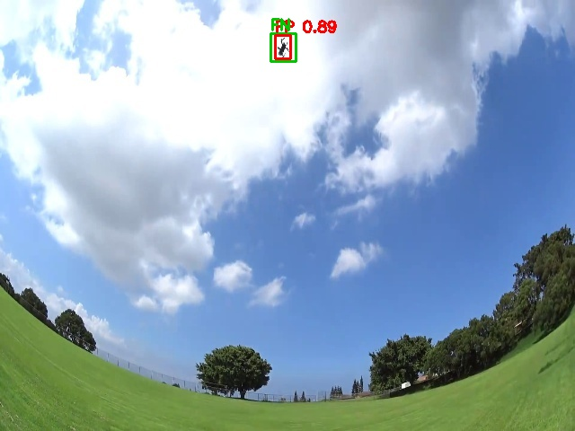 | 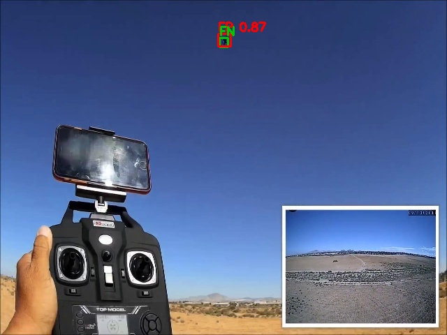 |

**FN 상위 — 라벨 오차·특수 난이도 혼재:**

| fn_000281 · GT 과대 | fn_000807 · 드론 일부만 프레임 | fn_000808 · 자막이 드론 가림 | fn_002018 · 강한 조명(LED) |
|:---:|:---:|:---:|:---:|
| 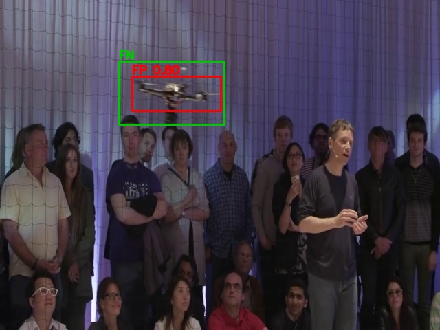 | 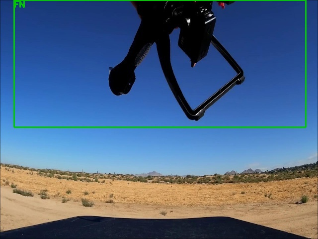 | 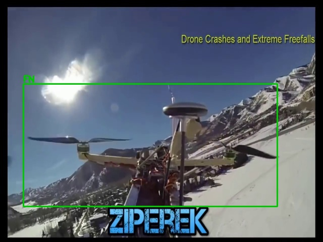 | 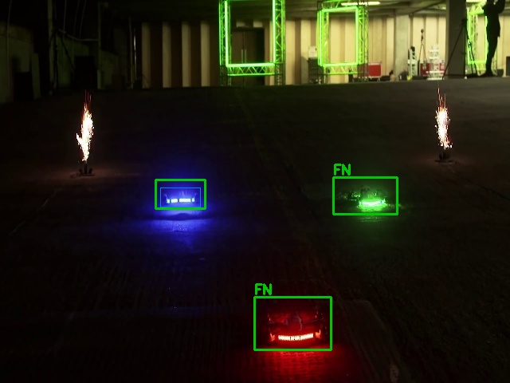 |

- 결론: Maciullo 0.89 천장은 **순수 모델 한계가 아니라 라벨 품질(박스 크기 오차·누락)+특수 난이도**의 영향.
  모델 추가 개선의 Maciullo AP 기대치는 이 천장 기준으로 해석할 것.
- 전체 시각화(506장): `reports/label_audit_maciullo/` (로컬 생성물, 미커밋).

---

## Demo (추론 예시)

test set 추론 결과 — `yolo26n` **merged-300ep**(권장 배포 모델), imgsz 640, conf 0.25.
(`demo/`: DUT-test `image0~9` + Maciullo-test `ground0~3`)

| image0 (DUT) | image8 (DUT) | ground1 (Maciullo) |
|:---:|:---:|:---:|
| 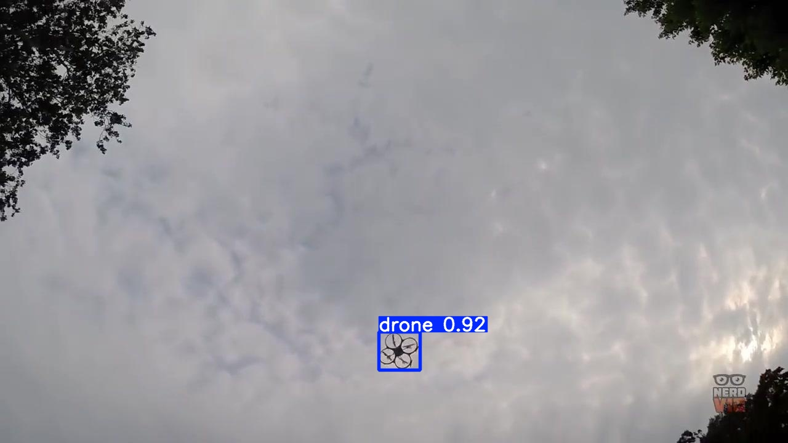 | 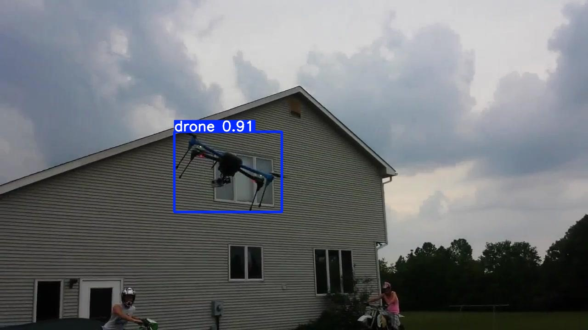 | 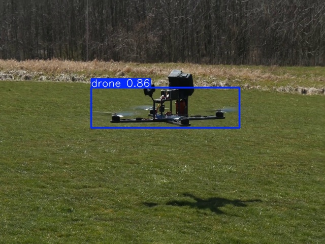 |

재현: `python scripts/predict.py --weights weights/yolo26n_drone_640_mergedataset_300epoch.pt --imgsz 640 --source /mnt/ssd_0/dataset/dut_yolo/images/test --max 10 --out demo`

---

## 모델 상세 (I/O)

ONNX를 추론 엔진에 통합할 때 필요한 입출력 방식에 대해서 간략히 설명한다 (imgsz 640 모델 기준; 960 변형은 입력·좌표가 960).

| 항목 | 사양 |
|------|------|
| 입력 | `images` `(1,3,640,640)` — float32(FP32·INT8) / float16(FP16) |
| 전처리 | **letterbox 640 · RGB · `/255` · CHW** (종횡비 보존 패딩, pad=114) |
| 출력 | `output0` `(1,300,6)` = `[x1,y1,x2,y2,score,class]`, 640 letterbox **픽셀** 좌표 |
| 후처리 | **NMS 불필요**(one-to-one head). `score ≥ 0.25` 필터 → letterbox 역산(패딩 빼고 scale로 나눔) → 원본 좌표 |
| 클래스 | `0 = drone` (단일 클래스, `nc=1`) |

INT8 모델도 입력은 float32다(Q/DQ는 그래프 내부 처리). 권장 conf 임계값 0.25는 디바이스에서 튜닝한다.

---

## 리포지토리 구조

```
scripts/   [데이터] voc2yolo.py  fetch_maciullo.py  merge_datasets.py  analyze_merge.py  dataset_stats.py
           [학습·평가] train.py  train_all.sh  eval.py  eval_compare.py  analyze_fn.py  predict.py
           [DETR 계열] yolo2coco.py  dfine_eval.py  (+configs/dfine/, D-FINE 레포 별도 clone)
           [export·벤치] export.py  parity_ncnn.py  bench_latency.py  bench_gpu.py  sahi_bench.py
configs/   dut_drone.yaml  merged_drone.yaml  eval_test_{dut,maciullo}.yaml
weights/   yolo26{n,s}_drone_{640,960}.pt (+_{fp32,fp16,int8}.onnx)
           yolo26n_drone_640_mergedataset_{100,300}epoch.pt (+onnx, +_ncnn_model/)
           yolo26{n,l}_drone_960p2_mergedataset_100epoch.pt
           dfine_n_drone_640_mergedataset_220epoch.pth
           metrics.json  parity·latency 리포트(생성물)
cpp/       drone_detector.{h,cpp}  test_host.cpp  CMakeLists.txt  mlsdk_glue.md  (ncnn-Vulkan)
docs/      ML2_ONDEVICE_RUNBOOK.md
reports/   ablation_matrix.md(SSOT)  far_drone_p2_960.md  yolo26_family_fps_4090.md
           training_curves.png  + 생성물(fn_size·sahi·dataset_comparison·old_vs_new 등)
demo/      추론 예시 (DUT image0~9 + Maciullo ground0~3)
Dockerfile · docker-compose.yml · requirements.txt
```

---

## 데이터셋

**출처 (Sources)**
- **DUT-Anti-UAV** (기본): <https://github.com/wangdongdut/DUT-Anti-UAV>
- **Maciullo DroneDetectionDataset** (병합 · 근접·중대형): 원본 <https://github.com/Maciullo/DroneDetectionDataset> · 사용한 HF mirror <https://huggingface.co/datasets/pathikg/drone-detection-dataset>

### DUT-Anti-UAV

DUT-Anti-UAV는 수동 준비. 아래 PASCAL VOC 구조로 `/mnt/ssd_0/dataset/DUT`에 배치/압축해제한다.
변환 스크립트는 이 트리를 **수정하지 않는다**(read-only).

```
/mnt/ssd_0/dataset/DUT/{train,val,test}/{img,xml}
  img/  *.jpg
  xml/  *.xml   (VOC: <size>, <object><name>, <bndbox> xmin/ymin/xmax/ymax)
```

| Split | 이미지 | 라벨 | 박스 | Negative | Skip(불량박스) |
|-------|-------:|----:|----:|---------:|--------------:|
| train | 5200 | 5200 | 5243 | 3 | 0 |
| val   | 2600 | 2600 | 2620 | 0 | 1 |
| test  | 2200 | 2200 | 2245 | 0 | 0 |
| **합계** | **10000** | **10000** | **10108** | **3** | **1** |

- 단일 클래스: 원본 `UAV`(10,109개) → `0: drone`(`nc=1`) 매핑.
- 객체 없는 train 3장 → 빈 `.txt`(negative). 불량 박스(w≤0/h≤0) 1개 스킵.

**변환 (원본 read-only):**
```bash
python scripts/voc2yolo.py        # --src /mnt/ssd_0/dataset/DUT  --dst /mnt/ssd_0/dataset/dut_yolo
python scripts/dataset_stats.py   # 박스 크기 히스토그램 + 샘플 박스 시각화 -> dut_yolo/_viz/
```

**박스 크기 분포 — 소형 객체 위주** (imgsz/P2 결정 근거).
정규화 변 `sqrt(w·h)`: 중앙값 **0.0226**(~14.5px @640), p25 0.0163, p75 0.0451, max 0.84.

| 크기 구간 (@imgsz 640) | 비율 |
|---|---:|
| SMALL (변 <32px) | **76.6%** |
| MEDIUM (32–96px) | 13.1% |
| LARGE (변 >96px) | 10.3% |
| tiny (<13px, 정규화변 <0.02) | 40.6% |

→ 드론 대부분 소형. 기본 `imgsz=640`(ML2 타깃) 유지. 소형 recall 향상 수단은 **imgsz=960·P2 head**.

### Maciullo DroneDetectionDataset — 병합

학습 데이터 확장용(10×, 근접·중대형 도메인 추가). HF mirror(`pathikg/drone-detection-dataset`)로 취득 → `/mnt/ssd_0/dataset/DroneDetection`에 materialize.

- 규모: train **51,446** / test **2,625** (HF mirror 값 — 공식 test 5,375과 다름). 전부 640×480, COCO xywh, 단일 class(`drone`).
- 578개 영상 파생이나 **HF mirror에 video_id 없음** → sequence provenance 복원 불가. **leakage-safe fallback**: Maciullo train 전량 → merged train, val은 **DUT 공식 val만**, 원본 test 2개(DUT-test·Maciullo-test)는 별도 eval로 보존.
- 병합 결과 `/mnt/ssd_0/dataset/merged_drone`: train **56,646**(DUT 5,200 + Maciullo 51,446) / val 2,600 / test_dut 2,200 · test_maciullo 2,625.
- 파이프라인: `scripts/fetch_maciullo.py`(취득·감사) → `scripts/merge_datasets.py`(YOLO 통일·leakage-safe 병합) → `scripts/analyze_merge.py`(스케일·배경 비교). 감사·비교·split 매핑은 `reports/`, old vs new 효과는 `reports/old_vs_new.md`.
- 효과 요약: Maciullo 도메인 mAP50 0.601→0.891·FP/img −78%, DUT 초소형은 소폭 trade-off.

```bash
.venv/bin/python scripts/fetch_maciullo.py      # HF → images + COCO 어노테이션 + AUDIT.md
.venv/bin/python scripts/merge_datasets.py      # merged_drone + configs/merged_drone.yaml
.venv/bin/python scripts/analyze_merge.py       # reports/dataset_comparison.md
```

---

## 환경 구성

### 방법 A — Docker

Docker Hub 이미지: **`hanmyeongil/yolo26:v1`** (빌드 없이 바로 사용).

```bash
docker compose pull      # Docker Hub에서 이미지 받기 (또는 docker compose build 로 직접 빌드)
docker compose run --rm dronear python scripts/voc2yolo.py
docker compose run --rm dronear python scripts/train.py
docker compose run --rm dronear python scripts/export.py
```

> ⚠️ **작업 경로 필수 설정.** `docker compose`는 **`docker-compose.yml`이 있는 repo 루트에서**
> 실행한다. 다른 경로에서 실행하면 compose 파일·상대 볼륨(`./scripts`, `./weights`, `./runs`)을
> 못 찾아 엉뚱한(새) 경로 기준으로 동작한다. 컨테이너 작업 디렉터리는 `working_dir=/workspace`
> 고정이며, `scripts/`·`configs/`·`weights/`·`runs/`가 여기에 마운트된다.
>
> `docker run`을 직접 쓸 때도 `-w /workspace` + repo 루트를 `/workspace`로 마운트해야 한다:
> ```bash
> docker run --rm --gpus all \
>   -v "$PWD":/workspace -w /workspace \
>   -v /mnt/ssd_0/dataset:/mnt/ssd_0/dataset \
>   hanmyeongil/yolo26:v1 python scripts/export.py
> ```

데이터셋은 호스트 경로 → 동일 컨테이너 경로로 마운트 → `configs/dut_drone.yaml`이 네이티브/컨테이너
양쪽 동작. **다른 머신은 `docker-compose.yml`의 데이터셋 볼륨 + config `path:` 한 줄을 자기
데이터 경로로 변경**한다(안 하면 컨테이너가 데이터를 못 찾음).

**재현성 검증 완료.** 베이스 `ultralytics/ultralytics:latest` + `onnxruntime`/`onnxslim`/
`onnxconverter-common`, 기본 polars → `polars-lts-cpu` 교체 → 동작 GPU 이미지(컨테이너 내 CUDA OK).
컨테이너 안에서 `scripts/export.py` 실행 → 호스트 venv와 동일 산출물(FP32 9.80MB, FP16 4.97MB
native-half, INT8 3.01MB), 모두 ORT 로드·출력 `[1,300,6]` 확인.

### 방법 B — venv (빠른 개발 루프)

```bash
python3 -m venv .venv && . .venv/bin/activate
# torch는 호스트 CUDA 12.8 드라이버에 맞는 cu128 빌드 먼저 (아래 Troubleshooting 참고)
pip install torch==2.11.0+cu128 torchvision==0.26.0+cu128 --index-url https://download.pytorch.org/whl/cu128
pip install -r requirements.txt
python scripts/voc2yolo.py
python scripts/train.py
```

---

## 재현 절차 (전체 명령)

각 단계는 Docker·venv 형태 모두 제공.

| 단계 | Docker | venv |
|------|--------|------|
| VOC→YOLO 변환 | `docker compose run --rm dronear python scripts/voc2yolo.py` | `python scripts/voc2yolo.py` |
| 데이터 통계 | `... python scripts/dataset_stats.py` | `python scripts/dataset_stats.py` |
| 학습(단일) | `... python scripts/train.py --model yolo26n.pt --name yolo26n_drone_640` | `python scripts/train.py ...` |
| 학습(n+s, 150ep) | `... bash scripts/train_all.sh` | `bash scripts/train_all.sh` |
| 평가(val+test) | `... python scripts/eval.py --weights weights/yolo26n_drone_640.pt` | `python scripts/eval.py ...` |
| Export ONNX/FP16/INT8 | `... python scripts/export.py --weights weights/yolo26n_drone_640.pt --stem yolo26n_drone_640` | `python scripts/export.py ...` |
| 속도 벤치 GPU(4090) | `... python scripts/bench_gpu.py` | `python scripts/bench_gpu.py` |
| 속도 벤치 CPU(ORT) | `... python scripts/bench_latency.py --stems yolo26n_drone_640 yolo26s_drone_640` | `python scripts/bench_latency.py ...` |
| 예측 데모 | `... python scripts/predict.py --weights weights/yolo26n_drone_640.pt` | `python scripts/predict.py ...` |

**학습 설정(ML2 baseline):** `yolo26n.pt`, `imgsz=640`, `epochs=150`, `patience=40`,
`batch=-1`(자동 → 4090에서 ~35), `cache=disk`, NMS-free head 유지. `yolo26s`는 정확도 비교군.
5-epoch 스모크 수렴 확인(mAP50 0.62→0.81).

### Troubleshooting (환경 이슈 — requirements 반영)

| 증상 | 원인 | 해결 |
|---|---|---|
| `cuda.is_available()=False`, "driver too old" | ultralytics가 torch `cu130` 끌어옴; 호스트는 CUDA 12.8 | `torch==2.11.0+cu128`(최신 cu128) 설치 |
| **Bus error(SIGBUS)** — 첫 체크포인트 저장 시 | `polars` 1.42 휠 import SIGBUS; ultralytics가 매 epoch `results.csv`를 polars로 읽음 | **`polars-lts-cpu`** 교체 |
| `cache=ram` SIGBUS | DataLoader가 캐시 배열을 `/dev/shm` 공유 | `cache=disk`(기본) 또는 `--cache False` |
| TFLite export 실패 (`tf.tile_36` rank 에러) | onnx2tf 1.28.8이 YOLO26 NMS-free head `Tile` 미지원 | ONNX 경로 사용; 필요시 onnx2tf 버전/`param_replacement.json` |

---

## 개선 로드맵 (소형·원거리)

- 완료 ✅: imgsz 960 · P2 head(960+P2 결합) · 추론 1280 · 데이터 병합 10× · **yolo26l-P2@960**(모델 스케일, 클라우드용) · **D-FINE-N@640**(DETR 계열 1차, 아래) → [Ablation](#ablation)
- 진행 🔄: **D-FINE-L@960** (RunPod 4×4090, yolo26l-P2 레시피 동등 비교) → 이후 temporal(detect-then-track) 후순위
- 보류: hard-negative(NEG_DIR) — Maciullo all-positive라 배경 FP 감소엔 별도 negative 셋 필요

### DETR 계열 1차 — D-FINE-N@640 결과

- 선정: RT-DETR 최소 모델 l(32M) = 온디바이스급 아님 → **D-FINE-N(3.8M, RT-DETR 계보 SOTA, ICLR 2025)**.
- 학습: merged · 640 · P2 없음 · seed 0 · COCO ckpt tuning · 220ep(스톡) · batch 32(lr 비례 0.0002). yolo26n C/D행과 동일 선상(테스트셋·imgsz·pretrained 동일). 릴리스 = ep191 EMA(`weights/dfine_n_drone_640_mergedataset_220epoch.pth`).
- 재현: `scripts/yolo2coco.py` → `configs/dfine/` → D-FINE `train.py` → `scripts/dfine_eval.py` (원시 결과 `reports/dfine_n_eval.json`).

**연산량·속도 스펙 (640, 실측)**:

| 모델 | Params | GFLOPs | 4090 FP32 | i9 CPU t4 | ML2 CPU |
|---|---:|---:|---:|---:|---:|
| yolo26n | 2.5M | 5.8 | 2.3ms (433FPS) | 13.2ms (76FPS) | ~15 FPS 실측 |
| D-FINE-N | 3.7M | 7.1 | 4.3ms (235FPS) | 26.0ms (39FPS) | ~7–9 FPS 추정 |

- GFLOPs는 **1.2×**인데 CPU 지연은 **2×** — FLOPs가 아니라 **커널 효율**(deformable attention·LayerNorm의 CPU 비친화) 차이. (산출: yolo=ultralytics profile, D-FINE=calflops — 동일 MACs×2 관례.)

**정확도 (held-out test)** — far/FP = [동일 greedy 프로토콜](reports/ablation_matrix.md)(conf 0.25·IoU 0.5) 직접 비교 가능. *AP는 산출기 상이(D-FINE=COCO eval, yolo=ultralytics) → 참고 비교*:

| 모델 (640) | DUT AP50/AP50-95* | DUT far | DUT <8px | Maci AP50/AP50-95* | Maci far | FP/img(DUT·Maci) |
|---|---|---:|---:|---|---:|---|
| yolo26n 100ep (C) | 0.927 / 0.619 | 0.820 | — | **0.891** / 0.445 | 0.783 | 0.06 · 0.05 |
| yolo26n 300ep (D) | 0.950 / 0.650 | 0.876 | 0.706 | 0.858 / 0.415 | 0.748 | 0.04 · 0.07 |
| **D-FINE-N 220ep** | 0.951 / **0.705*** | **0.944** | **0.934** | 0.866 / 0.428* | **0.818** | 0.08 · 0.20 |

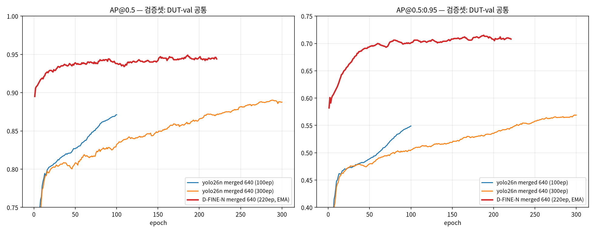

- **far-recall(동일 프로토콜): DUT +6.8pt(vs D)·Maciullo +3.5pt(vs C)** — 640·P2 없이 yolo26n-P2@960(E: 0.933)급 far. DETR 계열의 소형 객체 강점 확인.
- 트레이드오프: **FP/img 높음**(Maciullo 0.20 vs 0.05~0.07) — conf 스윕/라벨 노이즈 감안 필요. Maciullo AP50은 0.89 천장(라벨 품질) 아래 동급.
- 배포: CPU ~1.7–2× 느림(i9 threads=4 26.0ms vs 13.2ms) · **ncnn-Vulkan 이식 불가**(grid_sample) → **온디바이스 주력은 yolo26n 유지**, D-FINE은 클라우드 후보(L@960 진행 중).

**ML2 배포 경로 — D-FINE (요약)**: "불가"가 아니라 "CPU만, 느림".

| ML2 경로 | yolo26n | D-FINE-N |
|---|---|---|
| ORT CPU | ✅ **~15 FPS 실측** | ✅ ONNX 확인, **~7–9 FPS 추정** |
| ncnn-Vulkan (RDNA2 GPU) | ✅ 현 배포 경로 | ❌ grid_sample 미지원 |
| NNAPI·TFLite GPU delegate | — | ❌ attention op 커버리지 없음 → CPU fallback |
| TensorRT FP16 | — | 클라우드(4090) 전용 |

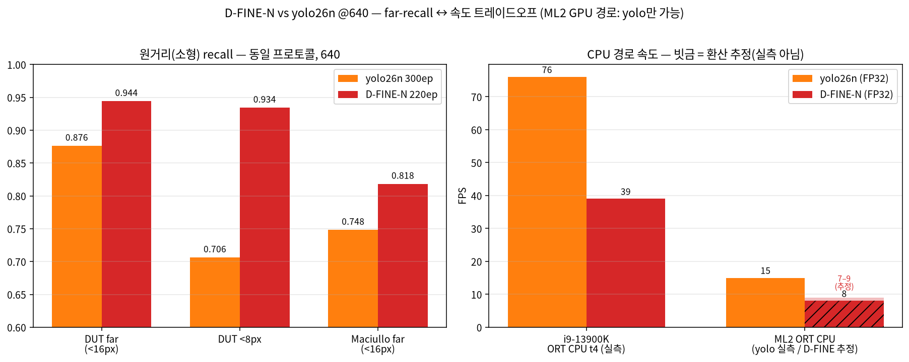

- 거래 구조: **far +6.8pt ↔ fps 절반**. 원거리 최우선이면 ORT CPU 실측 1회로 판정 가능(ONNX 교체만, NMS-free 동일).

---

## 라이선스 / 비고

데이터셋(**DUT-Anti-UAV**, **Maciullo DroneDetectionDataset**)은 각자 원 라이선스를 따른다. 여기서 재배포하지 않는다(위 출처 링크 참조).
