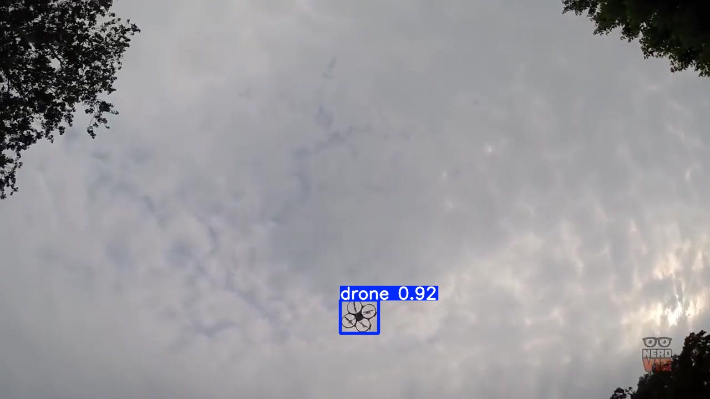
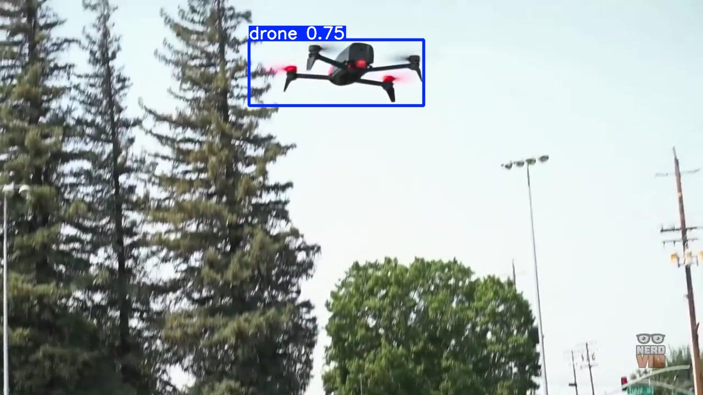
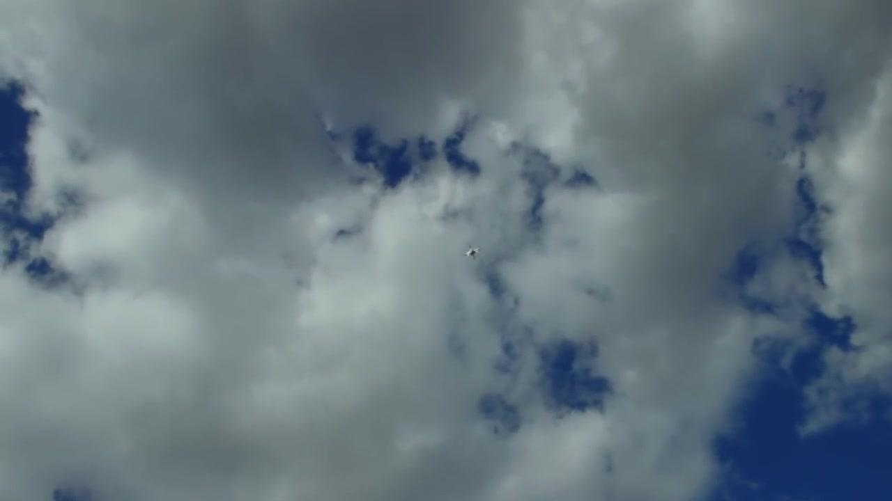

# DroneAR — YOLO26 Drone Detection for Magic Leap 2

> 🌐 한국어 버전: [README.md](README.md)

Train a **YOLO26** drone (UAV) detector on **DUT-Anti-UAV** → export for **Magic Leap 2 (ML2)**
deployment. A reproducible end-to-end pipeline.

- **Train host:** RTX 4090 24GB / Linux / CUDA (training only)
- **Inference target:** ML2 — AMD "Mero" SoC (Zen2 quad-core x86-64 CPU + RDNA2 iGPU), 16GB,
  AOSP Android 10 (API 29). **Not NVIDIA** → no TensorRT/CUDA on device.
  Validated path: **ONNX → ONNX Runtime (+MLSDK C API), CPU backend XNNPACK.**
- **Model decision:** `yolo26n` (nano) first, **NMS-free one-to-one head kept**, `imgsz=640`,
  INT8/FP16 export. CPU inference leaves the RDNA2 GPU for 120Hz AR stereo rendering.

> Status: full pipeline complete (data → train → eval → ML2 export → bench → Docker verify).

---

## Performance (model-selection reference)

### Accuracy (150 epochs) — `weights/metrics.json` (test split; val in json)

| Model | imgsz | mAP50 | mAP50-95 | Precision | Recall | Params(M) | FLOPs(G) | best.pt |
|-------|------:|------:|---------:|----------:|-------:|---------:|--------:|--------:|
| yolo26n | 640 | 0.951 | 0.648 | 0.963 | 0.922 | 2.4 | 5.2 | 5.4 MB |
| **yolo26n** | **960** | **0.968** | **0.699** | 0.976 | 0.936 | 2.4 | 11.7 | 5.5 MB |
| yolo26s | 640 | 0.958 | 0.681 | 0.968 | 0.945 | 9.5 | 20.5 | 20.3 MB |
| **yolo26s** | **960** | **0.970** | **0.723** | 0.981 | 0.956 | 9.5 | 46.2 | 20.4 MB |

> Params/FLOPs are hardware-independent complexity. **FLOPs(G)**: per-row imgsz, ultralytics fused,
> **2×MAC convention** (mul+add each = MACs×2), precision-independent. FLOPs ∝ input pixels, so 960 ≈ 2.25× of 640.

- imgsz **960 gives +4~5pp test mAP50-95 over 640** (~77% small objects → resolution helps).
  Inference cost rises (input 2.25×).
- Guide: latency-first → **yolo26n 640**; accuracy-first → **960**. yolo26s is the accuracy ceiling (~4× params).
- Inference examples: see the [Demo](#demo-inference-examples) section below.

### Inference speed — GPU (RTX 4090)

config: imgsz=640, batch=1 (single-stream), warmup=30, iters=200, **pure forward (no pre/post-processing, no NMS)**,
torch CUDA (`cuda.Event` timing), FPS = 1000/mean. Measured on **NVIDIA RTX 4090**. Raw: `weights/latency_gpu.md`.

| Model | Precision | latency mean±std (ms) | FPS |
|-------|-----------|---------------------:|----:|
| yolo26n | FP32 | 2.40 ± 0.10 | 417 |
| yolo26n | FP16 | 2.48 ± 0.10 | 403 |
| yolo26s | FP32 | 2.44 ± 0.14 | 410 |
| yolo26s | FP16 | 2.57 ± 0.08 | 389 |

- At batch=1 these small models do not saturate the RTX 4090 → launch/memory-bound, so model/precision differences are small.

**Precision vs GPU suitability** (all artifacts are ONNX):

| Precision | Nature | On GPU |
|-----------|--------|--------|
| FP32 | neutral (reference) | standard |
| FP16 | GPU/NPU-friendly (half) | benefits ↑ (no CPU gain — no native fp16 kernels) |
| INT8 | CPU/XNNPACK-oriented (QDQ Conv-only) | no real INT8 speedup ⚠️ |

INT8 GPU acceleration needs a separate TensorRT INT8 engine (not measured here). Accuracy is device-invariant — only speed differs.

### Inference speed — CPU (i9-13900K, ONNX Runtime)

config: ORT **CPUExecutionProvider**, imgsz=640, batch=1, warmup=30, iters=200,
`intra_op_num_threads`=1·4 (inter_op=1, sequential), FPS = 1000/mean. Measured on
**Intel i9-13900K**. Raw: `weights/latency_report.md`.

| Model | Precision | Size(MB) | threads=1 ms | threads=4 ms | threads=1 FPS | threads=4 FPS |
|-------|-----------|--------:|------------:|------------:|-------------:|-------------:|
| yolo26n | FP32 | 9.80 | 44.0 ± 0.5 | 13.2 ± 0.2 | 23 | 76 |
| yolo26n | FP16 | 4.97 | 45.5 ± 0.8 | 13.9 ± 0.2 | 22 | 72 |
| yolo26n | INT8 | 3.01 | **33.7 ± 0.9** | 15.1 ± 0.4 | **30** | 66 |
| yolo26s | FP32 | 38.17 | 149.6 ± 1.4 | 41.3 ± 0.9 | 7 | 24 |
| yolo26s | FP16 | 19.15 | 151.7 ± 1.5 | 42.4 ± 0.6 | 7 | 24 |
| yolo26s | INT8 | 10.24 | **86.6 ± 2.0** | 34.6 ± 0.7 | **12** | 29 |

- **FP16**: ORT CPU has no native fp16 kernels → no speedup (size/portability option).
- **INT8**: fastest single-thread. Conv-only QDQ, so at 4 threads dequant overhead shrinks the gain.
- Speeds are at imgsz 640. 960 not measured (input 2.25×).

### Export artifacts (precision · size) — NMS-free head, output `[1,300,6]`

| Precision | File | Size | Notes |
|-----------|------|-----:|-------|
| FP32 | `weights/yolo26n_drone_640_fp32.onnx` | 9.80 MB | reference; opset17, static, simplified |
| FP16 | `weights/yolo26n_drone_640_fp16.onnx` | 4.97 MB | native `half=True`; float16 I/O |
| INT8 | `weights/yolo26n_drone_640_int8.onnx` | **3.01 MB** | static PTQ (QDQ), Conv-only, 200-img calib |

**INT8 vs FP32** (same 20 val images, conf 0.25): yolo26n 27→27 (mean IoU 0.961, |Δscore| 0.075),
yolo26s 27→26 (mean IoU 0.966, |Δscore| 0.103) → negligible loss.

Comparison/resolution artifacts: yolo26s_640 FP32 38.2 / FP16 19.2 / INT8 10.2 MB ·
imgsz 960 (input `[1,3,960,960]`) yolo26n_960 10.0/5.1/**3.2** MB · yolo26s_960 38.4/19.3/10.5 MB
(`weights/yolo26{n,s}_drone_960_{fp32,fp16,int8}.onnx`).

---

## Demo (inference examples)

test set inference — `yolo26n_640` (main deploy model), imgsz 640, conf 0.25. (`demo/` holds image0~9)

| image0 | image2 | image4 |
|:---:|:---:|:---:|
|  |  |  |

Reproduce: `python scripts/predict.py --weights weights/yolo26n_drone_640.pt --imgsz 640 --source /mnt/ssd_0/dataset/dut_yolo/images/test --max 10 --out demo`

---

## Model spec (I/O)

The I/O contract needed to integrate the ONNX into an inference engine (imgsz 640 model; the 960
variant uses 960 input/coords).

| Item | Spec |
|------|------|
| Input | `images` `(1,3,640,640)` — float32 (FP32·INT8) / float16 (FP16) |
| Preprocess | **letterbox 640 · RGB · `/255` · CHW** (aspect-preserving pad, pad=114) |
| Output | `output0` `(1,300,6)` = `[x1,y1,x2,y2,score,class]`, 640 letterbox **pixel** coords |
| Postprocess | **no NMS** (one-to-one head). `score ≥ 0.25` filter → undo letterbox (subtract pad, divide by scale) → original coords |
| Class | `0 = drone` (single class, `nc=1`) |

The INT8 model also takes float32 input (Q/DQ is internal). Tune the conf threshold (0.25 default) on device.

---

## Repository layout

```
scripts/   voc2yolo.py  dataset_stats.py  train.py  train_all.sh
           eval.py  predict.py  export.py  bench_latency.py  bench_gpu.py
configs/   dut_drone.yaml
weights/   yolo26{n,s}_drone_{640,960}.pt
           yolo26{n,s}_drone_{640,960}_{fp32,fp16,int8}.onnx
           metrics.json  latency_report.md(CPU)  latency_gpu.md(GPU)
demo/      inference example images (image0~9; README shows 0/2/4)
Dockerfile · docker-compose.yml · .dockerignore · requirements.txt · README.md
```

---

## Dataset

DUT-Anti-UAV is prepared manually. Place/extract it at `/mnt/ssd_0/dataset/DUT` in the PASCAL VOC
layout below. The converter does **not** modify this tree (read-only).

```
/mnt/ssd_0/dataset/DUT/{train,val,test}/{img,xml}
  img/  *.jpg
  xml/  *.xml   (VOC: <size>, <object><name>, <bndbox> xmin/ymin/xmax/ymax)
```

| Split | Images | Labels | Boxes | Negative | Skipped(degenerate) |
|-------|-------:|------:|----:|---------:|-------------------:|
| train | 5200 | 5200 | 5243 | 3 | 0 |
| val   | 2600 | 2600 | 2620 | 0 | 1 |
| test  | 2200 | 2200 | 2245 | 0 | 0 |
| **total** | **10000** | **10000** | **10108** | **3** | **1** |

- Single class: source `UAV` (10,109) → `0: drone` (`nc=1`).
- 3 train images with no object → empty `.txt` (negative). 1 degenerate box (w≤0/h≤0) skipped.

**Convert (source read-only):**
```bash
python scripts/voc2yolo.py        # --src /mnt/ssd_0/dataset/DUT  --dst /mnt/ssd_0/dataset/dut_yolo
python scripts/dataset_stats.py   # box-size histogram + sample overlays -> dut_yolo/_viz/
```

**Box-size distribution — small-object heavy** (imgsz/P2 rationale).
normalized side `sqrt(w·h)`: median **0.0226** (~14.5px @640), p25 0.0163, p75 0.0451, max 0.84.

| Size bin (@imgsz 640) | Share |
|---|---:|
| SMALL (side <32px) | **76.6%** |
| MEDIUM (32–96px) | 13.1% |
| LARGE (side >96px) | 10.3% |
| tiny (<13px, norm side <0.02) | 40.6% |

→ Most drones are small. Baseline stays `imgsz=640`; the small-object recall levers are **imgsz=960 · P2 head**.

---

## Environment

### Option A — Docker (recommended, collaborator-reproducible)

Docker Hub image: **`hanmyeongil/yolo26:v1`** (use without building).

```bash
docker compose pull      # pull from Docker Hub (or docker compose build to build locally)
docker compose run --rm dronear python scripts/voc2yolo.py
docker compose run --rm dronear python scripts/train.py
docker compose run --rm dronear python scripts/export.py
```

> ⚠️ **Working directory matters.** Run `docker compose` **from the repo root** (where
> `docker-compose.yml` lives). Elsewhere it cannot find the compose file or relative volumes
> (`./scripts`, `./weights`, `./runs`) and runs against the wrong path. The container
> `working_dir=/workspace` is fixed, with `scripts/`·`configs/`·`weights/`·`runs/` mounted there.
>
> With plain `docker run`, mount the repo root to `/workspace` and set `-w /workspace`:
> ```bash
> docker run --rm --gpus all \
>   -v "$PWD":/workspace -w /workspace \
>   -v /mnt/ssd_0/dataset:/mnt/ssd_0/dataset \
>   hanmyeongil/yolo26:v1 python scripts/export.py
> ```

The dataset is mounted host-path → identical container-path so `configs/dut_drone.yaml` works in
both. **On another machine, change the dataset volume in `docker-compose.yml` and the `path:` line
in the config** (otherwise the container won't find the data).

**Reproducibility verified.** Base `ultralytics/ultralytics:latest` + `onnxruntime`/`onnxslim`/
`onnxconverter-common`, stock polars → `polars-lts-cpu` → a working GPU image (CUDA OK in-container).
Running `scripts/export.py` inside the container produced the same artifacts as the host venv
(FP32 9.80MB, FP16 4.97MB native-half, INT8 3.01MB), all loading in ORT with output `[1,300,6]`.

### Option B — venv (fast dev loop)

```bash
python3 -m venv .venv && . .venv/bin/activate
# Install the cu128 torch matching this host's CUDA 12.8 driver first (see Troubleshooting)
pip install torch==2.11.0+cu128 torchvision==0.26.0+cu128 --index-url https://download.pytorch.org/whl/cu128
pip install -r requirements.txt
python scripts/voc2yolo.py
python scripts/train.py
```

---

## Reproduce (full commands)

Each step has a Docker and a venv form.

| Step | Docker | venv |
|------|--------|------|
| Convert VOC→YOLO | `docker compose run --rm dronear python scripts/voc2yolo.py` | `python scripts/voc2yolo.py` |
| Dataset stats | `... python scripts/dataset_stats.py` | `python scripts/dataset_stats.py` |
| Train (single) | `... python scripts/train.py --model yolo26n.pt --name yolo26n_drone_640` | `python scripts/train.py ...` |
| Train (n+s, 150ep) | `... bash scripts/train_all.sh` | `bash scripts/train_all.sh` |
| Evaluate (val+test) | `... python scripts/eval.py --weights weights/yolo26n_drone_640.pt` | `python scripts/eval.py ...` |
| Export ONNX/FP16/INT8 | `... python scripts/export.py --weights weights/yolo26n_drone_640.pt --stem yolo26n_drone_640` | `python scripts/export.py ...` |
| Speed bench GPU (4090) | `... python scripts/bench_gpu.py` | `python scripts/bench_gpu.py` |
| Speed bench CPU (ORT) | `... python scripts/bench_latency.py --stems yolo26n_drone_640 yolo26s_drone_640` | `python scripts/bench_latency.py ...` |
| Predict demo | `... python scripts/predict.py --weights weights/yolo26n_drone_640.pt` | `python scripts/predict.py ...` |

**Training config:** `yolo26n.pt`, `imgsz=640`, `epochs=150`, `patience=40`, `batch=-1`
(auto → ~35 on the 4090), `cache=disk`, NMS-free head kept. `yolo26s` is the accuracy comparison.
A 5-epoch smoke confirmed convergence (mAP50 0.62→0.81).

### Troubleshooting (environment fixes, in requirements)

| Symptom | Cause | Fix |
|---|---|---|
| `cuda.is_available()=False`, "driver too old" | ultralytics pulls torch `cu130`; host is CUDA 12.8 | install `torch==2.11.0+cu128` (newest cu128) |
| **Bus error (SIGBUS)** at first checkpoint save | `polars` 1.42 wheel SIGBUS on import; ultralytics reads `results.csv` via polars every epoch | replace with **`polars-lts-cpu`** |
| SIGBUS with `cache=ram` | DataLoader shares cached arrays via `/dev/shm` | use `cache=disk` (default) or `--cache False` |
| TFLite export fails (`tf.tile_36` rank error) | onnx2tf 1.28.8 can't convert YOLO26 NMS-free head `Tile` | use the ONNX path; if needed, change onnx2tf version / `param_replacement.json` |

---

## Improvement options (small objects)

Dataset ~77% small → small-object recall levers:
- **imgsz 960 retrain:** `python scripts/train.py --imgsz 960 --name yolo26n_drone_960`
- **P2 head** (stride-4 fine features): `--model yolo26-p2.yaml` (from scratch), then re-export
- need more accuracy → **yolo26s**

> Model inference / app implementation / device deployment are out of scope for this repo.
> Hand the collaborator the **weights/ONNX artifacts** (`weights/`).

---

## License / notes

The DUT-Anti-UAV dataset keeps its own license; not redistributed here.
